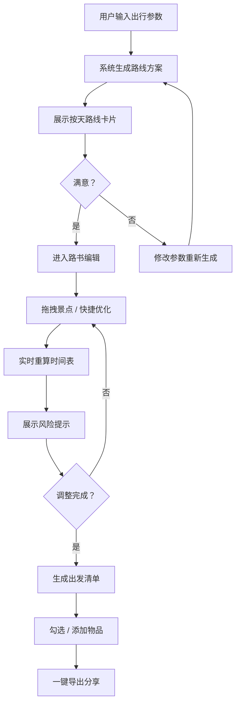

## 1. 产品概述
「路书行」是一款面向个人自驾游客的移动端 Web App，将用户一句话出行愿望编排成可落地的路书。核心解决自驾游规划中路线碎片化、信息散落、难以微调的痛点。
- 目标用户：有自驾出行需求的个人及家庭用户，偏好自主规划、灵活调整路线
- 市场价值：降低自驾路书制作门槛，从「想走」到「能走」仅需三步

## 2. 核心功能

### 2.1 用户角色
| 角色 | 注册方式 | 核心权限 |
|------|----------|----------|
| 普通用户 | 无需注册 | 行程生成、路书编辑、清单导出 |

### 2.2 功能模块
1. **行程生成页**：输入出行参数，AI 生成按天拆分的路线卡片
2. **路书编辑页**：拖拽微调景点顺序，一键优化策略，实时更新时间表
3. **出发清单页**：按路线自动生成清单，支持一键导出分享

### 2.3 页面详情
| 页面名称 | 模块名称 | 功能描述 |
|----------|----------|----------|
| 行程生成页 | 出行参数表单 | 输入出发地、天数、同行人、车辆类型、每日驾驶时长、出行偏好（看景/亲子/露营/少走山路） |
| 行程生成页 | 路线卡片列表 | 按天展示路线卡片，每张卡片标注每日里程、预计驾驶时长、途经服务区、加油/充电建议 |
| 行程生成页 | 生成动画 | 提交后展示路线编排加载动画，增强等待体验 |
| 路书编辑页 | 日程时间轴 | 按天展示行程时间轴，景点以可拖拽卡片呈现 |
| 路书编辑页 | 拖拽调整 | 支持景点在不同天之间拖拽移动，自动重算时间和里程 |
| 路书编辑页 | 快捷优化 | 少开车、早到酒店、增加午餐点等一键优化按钮 |
| 路书编辑页 | 风险提示 | 调整后实时展示风险提示（超时驾驶、无服务区路段等） |
| 路书编辑页 | 调整后时间表 | 展示调整后的每日行程时间线 |
| 出发清单页 | 自动清单 | 根据路线特征自动生成证件、车辆检查、保暖、防晒、应急药品等分类清单 |
| 出发清单页 | 清单项管理 | 支持勾选已完成项、手动添加自定义项 |
| 出发清单页 | 一键导出 | 生成文本/图片格式清单，支持复制或下载分享给同行人 |

## 3. 核心流程

用户在首页输入出行参数后，系统基于预设规则引擎生成行程路线，以按天拆分的路线卡片展示；用户进入路书编辑页，通过拖拽或快捷按钮微调行程，系统实时重算并给出风险提示；最后用户在出发清单页查看自动生成的物品清单，勾选后一键导出分享。

## 4. 用户界面设计

### 4.1 设计风格
- **主色调**：大地色系 —— 沙漠金 #D4A574 作为主色，森林绿 #2D5A3D 作为辅助色，传达自然探索与公路旅行感
- **辅助色**：落日橙 #E8724A 用于强调和行动按钮，石板灰 #4A5568 用于文字
- **背景色**：暖白 #FAF7F2 搭配微妙纹理感
- **按钮风格**：圆角胶囊按钮，带轻微阴影，按压时有缩放反馈
- **字体**：标题使用「思源宋体」风格衬线体，正文使用「苹方」风格无衬线体
- **布局风格**：移动端卡片式布局，底部导航栏切换三个模块
- **图标风格**：线性图标搭配局部填充，自然旅行主题

### 4.2 页面设计概述
| 页面名称 | 模块名称 | UI 元素 |
|----------|----------|----------|
| 行程生成页 | 出行参数表单 | 卡片式表单，输入框带图标前缀，偏好选择使用标签式多选，底部固定生成按钮 |
| 行程生成页 | 路线卡片列表 | 每日一张横向卡片，顶部日期标签，内部展示里程数字、驾驶时长、服务区标签、加油/充电图标，卡片间用虚线路线连接 |
| 行程生成页 | 生成动画 | 公路动画 + 百分比进度，品牌色渐变 |
| 路书编辑页 | 日程时间轴 | 左侧时间刻度，右侧景点卡片，卡片可拖拽，拖拽时目标区域高亮 |
| 路书编辑页 | 快捷优化 | 底部浮动工具栏，图标+文字按钮，点击后展开选项面板 |
| 路书编辑页 | 风险提示 | 顶部横幅，黄/红双色提示条，可展开查看详情 |
| 出发清单页 | 自动清单 | 分类折叠面板，每项左侧勾选框，完成后删除线效果 |
| 出发清单页 | 一键导出 | 底部固定导出按钮，点击弹出分享方式选择（复制文本/下载图片） |

### 4.3 响应式设计
- 移动优先设计，适配 375px-428px 主流手机宽度
- 底部 Tab 导航，单手可触达
- 触控优化：拖拽操作带触觉反馈视觉提示，按钮最小 44px 触控区域
- 横屏时自动切换为左右分栏布局
