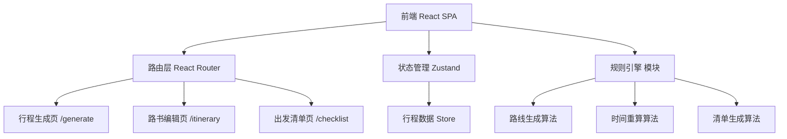
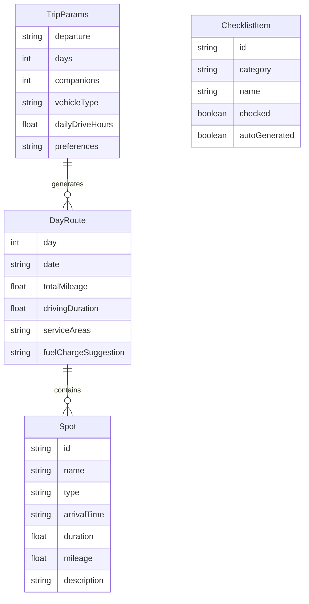

## 1. 架构设计



## 2. 技术说明
- **前端**：React@18 + Tailwind CSS@3 + Vite
- **初始化工具**：Vite (npm create vite@latest)
- **后端**：无后端，纯前端 + 本地规则引擎模拟
- **数据库**：无数据库，使用内存状态 + localStorage 持久化
- **拖拽库**：@dnd-kit/core + @dnd-kit/sortable
- **状态管理**：Zustand
- **路由**：React Router v6
- **图标**：Lucide React
- **动画**：Framer Motion

## 3. 路由定义
| 路由 | 用途 |
|------|------|
| / | 行程生成页 - 输入参数生成路线 |
| /itinerary | 路书编辑页 - 拖拽微调行程 |
| /checklist | 出发清单页 - 查看/导出清单 |

## 4. API 定义
无后端 API，所有数据通过前端规则引擎生成。核心数据结构如下：

```typescript
interface TripParams {
  departure: string
  days: number
  companions: number
  vehicleType: 'fuel' | 'electric' | 'hybrid'
  dailyDriveHours: number
  preferences: ('scenic' | 'family' | 'camping' | 'less_mountain')[]
}

interface DayRoute {
  day: number
  date: string
  totalMileage: number
  drivingDuration: number
  serviceAreas: string[]
  fuelChargeSuggestion: string
  spots: Spot[]
}

interface Spot {
  id: string
  name: string
  type: 'scenic' | 'restaurant' | 'hotel' | 'service_area' | 'rest'
  arrivalTime: string
  duration: number
  mileage: number
  description: string
}

interface ItineraryData {
  params: TripParams
  routes: DayRoute[]
  warnings: string[]
}

interface ChecklistItem {
  id: string
  category: string
  name: string
  checked: boolean
  autoGenerated: boolean
}

interface TripStore {
  params: TripParams | null
  itinerary: ItineraryData | null
  checklist: ChecklistItem[]
  setParams: (params: TripParams) => void
  setItinerary: (data: ItineraryData) => void
  moveSpot: (spotId: string, fromDay: number, toDay: number, toIndex: number) => void
  applyOptimization: (type: 'less_drive' | 'early_hotel' | 'add_lunch') => void
  toggleChecklistItem: (id: string) => void
  addChecklistItem: (category: string, name: string) => void
}
```

## 5. 数据模型

### 5.1 数据模型定义


